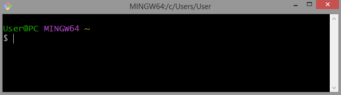

# Основные команды

Чтобы начать работу с [[Введение#^7165be|Git]] необходимо открыть нужную папку через Командную строку, Терминал IDE или прилагаемый Git Bash.

## Первичные действия
`git --version`  - вызов информации установленной версии [[Введение#^7165be|Git]];

`git config --global user.name "your_name"`  - занесение в глобальную конфигурацию своего имени, где на месте your_name ваше имя;

`git config --global user.mail your@mail.ru`  - занесение в глобальную конфигурацию свой адрес эл.почты, где на месте `your@mail.ru` ваш адрес;
>[!NOTE] Существует три множества конфигурации config:
>`--system` для обозначения во всей системе для всех пользователей;
>`--global` для обозначения конкретного пользователя в системе;
>`--local` обозначение будет действовать только для текущего хранилища.

`git config --list`  - вызов полной информации о конфигурации;

`git init`  - инициализация папки как отслеживаемое хранилище;

## Работа с версиями проекта в одной ветке
`git status` - вызов информации о статусе происходящего в папке-хранилище на данный  момент;

`git add file.format`^[например file.txt] - переведение файла в статус отслеживаемого в фазу [[Введение#^a1c3f0|staged]];
>[!NOTE] `git add .` - переведение всех измененных файлов в фазу [[Введение#^a1c3f0|staged]]

`git commit -m "your_comment"` - фиксирование новой версии файла и перевода его из фазы [[Введение#^a1c3f0|staged]] в фазу [[Введение#^7e4013|commitied]];
>[!NOTE] Параметры команды `commit`:
>`-m` - позволяет комментировать изменения в версии;
>`-a` - позволяет сразу переводить версию из фазы [[Введение#^9ee1b3|modified]] в фазу [[Введение#^7e4013|commitied]]. Пример: `git commit -am "your_comment"`;
>`--amend` - позволяет создать параллельную копию последней версии с другим комментарием. Пример: `git commit --amend -m "your_comment"`.

`git log` - вызов информации о всех версиях с нашими комментариями;
>[!TIP] Можно добавить параметр `-p` в конце чтобы увидеть подробные изменения каждой версии и `--oneline` для сокращенной версии.

`git checkout index`^[[[Введение#Индекс|индекс]] при вводе можно сократить до 4 символов] - возвращение к нужной версии по ее индексу;
>[!TIP] Чтобы переместиться на одну версию назад можно вместо [[Введение#Индекс|индекса]] прописать `HEAD^`. Количество знаков `^` обозначает на сколько версий назад нужно переместиться. Если нам нужно переместиться намного дальше лучше использовать `HEAD~10`, где число `10` означает на сколько версий назад нужно переместиться. Эти ссылки можно использовать везде где возможно использование [[Введение#Индекс|индекса]].

`git checkout master`^[master - название ветки, которая может называться по-другому] - возвращение к самой последней версии на ветке master;
`git diff` - показывает различия между последней и изменяемой в данный момент версий файла;
>[!NOTE] Если файл уже имеет статус [[Введение#^a1c3f0|staged]] (т.е. отслеживается), то чтобы увидеть изменения нужно добавить в конце параметр `--staged`.

`git show object` - выводит детальную информацию об `object`, который может быть версией файла в виде [[Введение#Индекс|индекса]];

`git restore` - откат текущего состояния файла к последней версии;

`git revert HEAD` - создает копию предыдущей версии (без последних изменений) и вставляет ее как последнюю версию;
>[!WARNING] Обычно используется для отмены сохраненных изменений в удаленном хранилище.

`git tag name` - создание для текущей версии имени `name`, по которому к ней можно обращаться;
>[!TIP] Чтобы создать имя для другой версии не переходя на нее нужно добавить в конце ее [[Введение#Индекс|индекс]].

`git describe` - выводит информацию о ближайшем тэге и количество измененных версий до него относительно текущей;
>[!NOTE] Чтобы посмотреть информацию относительно другого объекта нужно в конце добавить его обозначение (название ветки, тэг или [[Введение#Индекс|индекс]]).

## Работа с файлами
`git mv name_file new_name_file` - переименования `name_file` в `new_name_file`;
>[!NOTE] Добавив имя каталога перед новым именем файла можно его туда перенести. Пример: `git mv name_file /catalog/new_name_file`.

`git rm file` - удаление `file` из каталога;
>[!NOTE] Добавить параметр `--cached` после `rm` чтобы убрать файл из фазы [[Введение#^7e4013|commitied]], но оставить в каталоге.

## Работа с ветками
`git branch new-api` - создание новой ветки `new-api`;
>[!TIP] Чтобы на нее перейти нужна команда `git checkout new-api`, но можно сократить до одной команды `git checkout -b dev`, которая создаст ветку `dev` и сразу на нее перейдет. Если нужно создать ветку на основе [[Введение#Индекс|индекса]], то `git checkout -b new-branch index`.

`git branch` - выводит список всех веток в хранилище;

`git merge your_branch` - объединение текущей ветки с веткой `your_branch`;

`git branch -d your_branch` - удаление ветки `your_branch`;
>[!NOTE] Если нужно удалить ветку без объединения то вместо `-d` нужно `-D`.

`git reset HEAD^` - перенос указателя текущей ветки на одну версию назад;
>[!NOTE] Если добавить параметр `--hard index` вместо `HEAD^` указатель текущей ветки переместиться на версию с [[Введение#Индекс|индексом]] `index`.

`git branch -f main index` - перемещение указателя ветки `main` на версию с [[Введение#Индекс|индексом]] `index`;

`git log --graph` - покажет визуально работу с ветками и их версиями;

`git rebase branch_name` - перемещает копию всей текущей ветки в конец ветки `branch_name` как ее продолжение;
>[!NOTE] Указатель ветки при этом надо перемещать в конец самому с помощью `checkout`.

`git rebase -i HEAD~4` - открывает блокнот с 4 (можно поставить любую цифру) последними версиями текущей ветки, каждую из которых можно удалить или переместить, для создания копии ветки с этими изменениями;

`git cherry-pick index1 index2 indexN` - копирование версий с [[Введение#Индекс|индексами]] `index1 index2 indexN` в таком же порядке в текущую ветку;
>[!NOTE] Указатель ветки при этом сам сместится на последнюю версию.

`git branch -M main` - смена имени текущей ветки на имя `main`;

## Работа с удаленным хранилищем
`git remote add origin address` - добавление удаленного хранилища для работы с ним.
>[!NOTE] Значение команд
>`remote` - нужна исключительно для манипуляции с удаленными хранилищами;
>`origin` - имя удаленного хранилища, которое задает пользователь (оно может быть любым);
>`adress` - интернет-адрес удаленного хранилища в форме протокола HTTPS или SSH. Пример для HTTPS: `https://github.com/user_name/your_repository.git`;

